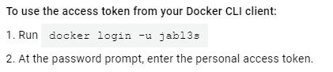
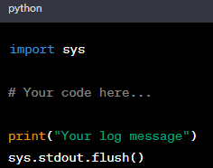
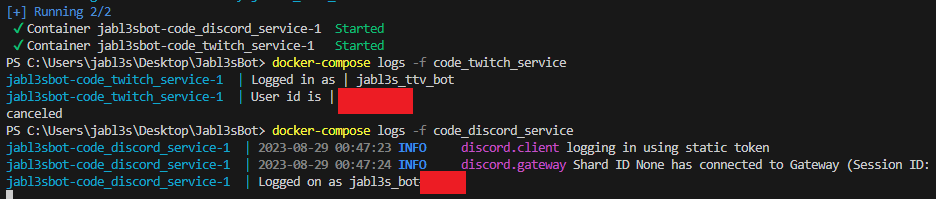

# Jabl3sBot  
docker stylized assistant, with twitch and discord use etc etc  
  
  
Consider installing harbor for self hosted repo benifits  
  
  
---PI specific:::---  
  
sudo rpi-eeprom-update -a  
sudo nano /etc/default/rpi-eeprom-config OR sudo rpi-eeprom-config --edit
BOOT_ORDER=0xf14  
  
1 is for USB boot.  
4 is for SD card boot.  
F signifies that if the preferred boot method (USB) fails, it should fall back to the secondary option (SD card).  
  
sudo rpi-eeprom-config --out /lib/firmware/raspberrypi/bootloader/critical/pieeprom.bin  
  
sudo shutdown -h now

---IN DEV RUN:::---  

docker-compose up -d --build  
docker-compose logs -f code_twitch_service  
docker-compose logs -f code_discord_service  
docker-compose down -v  

--- CLOSE ---  
Flush python output so that the compose logs can see wassup...  
  
  

  
  